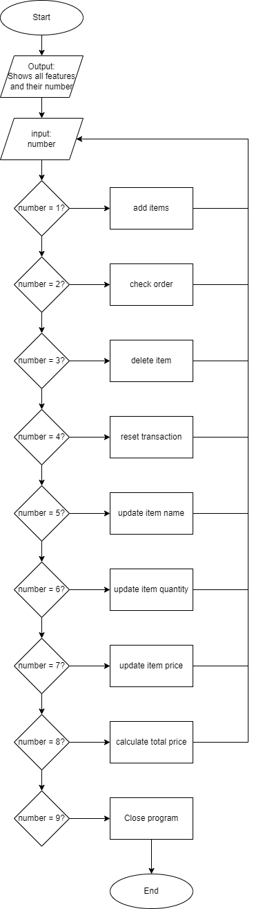
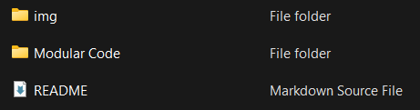

# Python Project: Self-Service Cashier

## A. Project Background

Andi is the owner of a large supermarket in one of the cities of Indonesia. Andi has a plan to improve his business, by creating a self-service cashier system in his supermarket. By using the self-service cashier, customers can add the purchased items, the quantity of purchased items, the price of the purchased items and using other features. By doing so, customers can purchase items from the supermarket remotely. After doing some research, Andi realized that he needs a Programmer's help to create and make sure that the self-service cashier system could run smoothly.

## B. Objective

Learning objective: 
* Create a program with simple UI using Python
* Using OOP to create Python program
* Applying PEP8 principles to write clean Python program 
* Applying modular code concept in python programming

Program objective: 
* Adding new item to shopping cart
* Show/check items in shopping cart 
* Delete an item from shopping cart  
* Delete all items from shopping cart (reset transaction)
* Updating item name
* Updating item quantity
* Updating item price
* Calculate total price

## C. Modular Code Description
By the previous program objective, there are two modular codes which need to be created.

### Transaction.py
This module consist of Transaction class and its methods. Here are the description of each methods in Transaction class:

_Diagram 1: Description of Transaction class' methods_

### Cashier.py
This module consist of simple UI/simple main menu for the self-service cashier program. This module utilized the Transaction module (by importing all methods). Here are the flowchart of Cashier.py:

_Diagram 2: Self-service Cashier simple main menu flowchart_

## D. Program Guideline
1. Download this git repository to your local computer.
\
_Diagram 3: Self-service Cashier simple main menu_

_Diagram 4: Self-service Cashier simple main menu_

