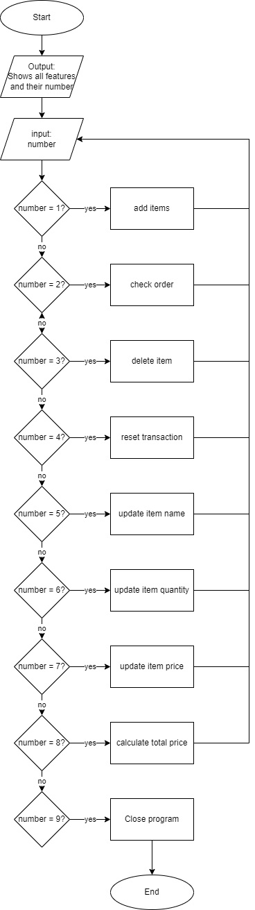
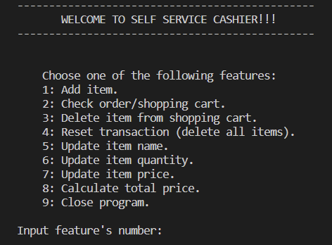
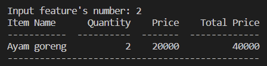
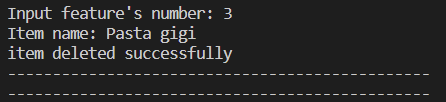
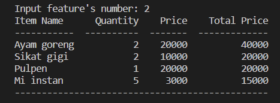

# Python Project: Self-Service Cashier

## A. Project Background

Andi is the owner of a large supermarket in one of the cities of Indonesia. Andi has a plan to improve his business, by creating a self-service cashier system in his supermarket. By using the self-service cashier, customers can add the purchased items, the quantity of purchased items, the price of the purchased items and using other features. By doing so, customers can purchase items from the supermarket remotely. After doing some research, Andi realized that he needs a Programmer's help to create and make sure that the self-service cashier system could run smoothly.

## B. Objective

Learning objective: 
* Create a program with simple UI using Python
* Using OOP to create Python program
* Applying PEP8 principles to write clean Python program 
* Applying modular code concept in python programming

Program objective: 
* Adding new items to shopping cart
* Show/check items in shopping cart 
* Delete an item from shopping cart  
* Delete all items from shopping cart (reset transaction)
* Updating item name
* Updating item quantity
* Updating item price
* Calculate total price

## C. Modular Code Description
By the previous program objective, there are two modular codes which need to be created.

### Transaction.py
This module consist of Transaction class and its methods. Here are the description of each methods in Transaction class:

_Diagram 1: Description of Transaction class' methods_ \

### Cashier.py
This module consist of simple UI/simple main menu for the self-service cashier program. This module utilized the Transaction module (by importing all methods). Here are the flowchart of Cashier.py and simple main menu of self-service cashier program:

_Diagram 2: Self-service Cashier simple main menu flowchart_ \

_Diagram 3: Self-service Cashier simple main menu_ \

## D. Guide to Use Self-service Cashier Program
There are two ways to start the Self-service Cashier Program.

### EXE files
1. Download this git repository to your local computer.
2. Open the "Program (EXE file)" folder.
3. Double-click the "Cashier" EXE file to run the program.

### Terminal/Command Prompt
1. Download this git repository to your local computer.
2. Make sure that the tabulate library is installed.
3. Execute "Cashier.py" in "Modular Code" folder by using terminal/command prompt.

## E. Test Case

### Test Case 1: Adding Items
Adding an item to shopping cart\

Checking the shopping cart\

### Test Case 2: Deleting an Item
Shopping cart before deleting "Pasta gigi"\

Deleting "Pasta gigi"\

Shopping cart after deleting "Pasta gigi"\

### Test Case 3: Resetting transaction
Shopping cart before resetting transaction\

Resetting transaction\

Shopping cart after the reset\

### Test Case 4: Calculating Total price
Items in shopping cart\

Calculating total price\

## F. Conclusion
Overall, the program worked as intended. However, the program still has many possibilites of improvement, for example:
* Improving the UI;
* Adding more features;
* Integrating the program with the supermarket's item list data.

